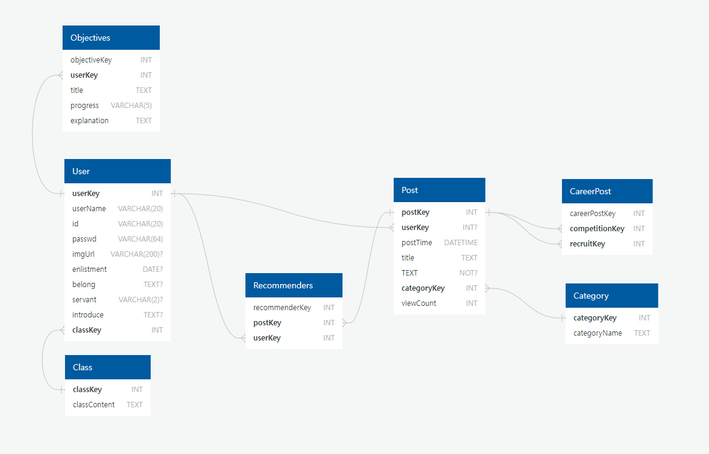

# DB ERD

# 1. Class

사용자를 구분하는 이름을 저장합니다.

| 이름 | 타입 | 설명 | 비고 |
| --- | --- | --- | --- |
| classKey | INT | class들을 구분함 | NOT NULL, AUTO_INCREMENT, PRIMARY KEY |
| classContent | TEXT | class명을 저장함 | NOT NULL |

# 2. User

사용자들을 저장합니다. (Class 테이블은 없으나 key에 따른 구분명만 담는 테이블로 간주)

| 이름 | 타입 | 설명 | 비고 |
| --- | --- | --- | --- |
| userKey | INT | 사람들을 구분함 | NOT NULL, AUTO_INCREMENT, PRIMARY KEY |
| userName | VARCHAR(20) CHARACTER SET utf-8 | 사람들이 가입할 때 정하는 이름 | 익명을 지향한다면 사라질 수도 있음, UNIQUE KEY, NOT NULL |
| id | VARCHAR(20) | 로그인할 때 사용하는 id | UNIQUE KEY, NOT NULL |
| passwd | VARCHAR(64) | 로그인할 때 사용하는 password | 보안을 위해 SHA-256을 사용하여 hash로 저장, salt를 추가할 수 있음, NOT NULL |
| imageUrl | VARCHAR(200) | 프로필 사진의 저장 경로 |  |
| enlistment | DATE | 입대한 날짜 |  |
| belong | TEXT | 소속 부대 |  |
| servant | VARCHAR(2) | 육/해/공 구분 |  |
| introduce | TEXT | 소개글 |  |
| classkey(←Class) | INT | 밀리패스API 등으로 인증 후에 병인지 간부인지 등을 구분 | 밀리패스API를 사용하지 않을 수도 있고, 구분하는 필드가 필요없을 수도 있음, NOT NULL, DEFAULT 0, FOREIGN KEY |

# 3. Category

게시글들을 구분하는 카테고리명을 key에 연결하는 테이블

| 이름 | 타입 | 설명 | 비고 |
| --- | --- | --- | --- |
| categoryKey | INT | 카테고리를 구분함 | NOT NULL, AUTO_INCREMENT, PRIMARY KEY |
| categoryName | TEXT | 카테고리 이름 | NOT NULL |

# 4. Post

작성한 게시글들을 저장합니다.

| 이름 | 타입 | 설명 | 비고 |
| --- | --- | --- | --- |
| postKey | INT | 게시글들을 구분함 | NOT NULL, AUTO_INCREMENT, PRIMARY KEY |
| userKey(←User) | INT | 작성한 게시자를 표시 | FOREIGN KEY |
| postTime | DATETIME | 작성한 시간 저장 | NOT NULL, DEFAULT CURRENT_TIMESTAMP |
| title | TEXT | 게시글 제목 | NOT NULL |
| body | TEXT | 게시글에 작성한 글을 저장 | NOT NULL |
| categoryKey(←Category) | INT | 카테고리 저장 | NOT NULL, FOREIGN KEY |
| viewCount | INT | 게시글 조회수 저장 | NOT NULL, DEFAULT 0 |

# 5. CareerPost

대회 게시 글과 사람 구하는 글을 이어주는 테이블

| 이름 | 타입 | 설명 | 비고 |
| --- | --- | --- | --- |
| careerPostKey | INT | 각각을 구분함 | NOT NULL, AUTO_INCREMENT, PRIMARY KEY |
| competitionKey(←Post) | INT | 대회 게시글을 저장 | NOT NULL, FOREIGN KEY |
| recruitKey(←Post) | INT | 사람 구하는 게시글을 저장 | NOT NULL, FOREIGN KEY |

# 6. Recommenders

게시글에 따른 추천인을 저장합니다.

| 이름 | 타입 | 설명 | 비고 |
| --- | --- | --- | --- |
| recommenderKey | INT | 각각을 구분함 | NOT NULL, AUTO_INCREMENT, PRIMARY KEY |
| postKey(←Post) | INT | 추천한 게시글 | NOT NULL, FOREIGN KEY |
| userKey(←User) | INT | 추천한 사람 | NOT NULL, FOREIGN KEY |

# 7. Comment

게시글에 달린 댓글들을 저장합니다.

| 이름 | 타입 | 설명 | 비고 |
| --- | --- | --- | --- |
| commentKey | INT | 댓글들을 구분함 | NOT NULL, AUTO_INCREMENT, PRIMARY KEY |
| userKey(←User) | INT | 댓글을 단 작성자를 표시 | FOREIGN KEY |
| body | TEXT | 댓글 내용을 저장 | NOT NULL |
| postKey(←Post) | INT | 댓글이 달린 게시글을 표시 | NOT NULL, FOREIGN KEY |
| commentTime | DATETIME | 댓글이 달린 시간을 표시 | NOT NULL, DEFAULT CURRENT_TIMESTAMP |
| parentKey(←Comment) | INT | 답글인 경우 무엇에 대한 답글인지 댓글 표시 | FOREIGN KEY |

# 8. Objectives

사용자 각각의 목표를 저장합니다.

| 이름 | 타입 | 설명 | 비고 |
| --- | --- | --- | --- |
| objectiveKey | INT | 목표를 구분함 | NOT NULL, AUTO_INCREMENT, PRIMARY KEY |
| userKey(←User) | INT | 목표를 설정한 유저를 표시 | FOREIGN KEY, NOT NULL |
| title | TEXT | 목표의 제목 | NOT NULL |
| progress | VARCHAR(5) | 목표의 진행 상태 구분 | NOT NULL |
| explanation | TEXT | 목표 구체적 설명 | NOT NULL |